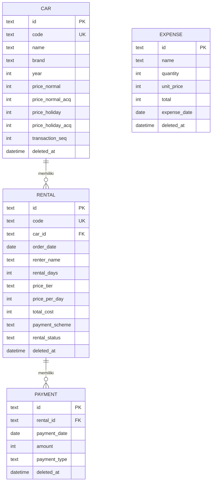

# PRD — Aplikasi Manajemen Data Sewa Mobil

| | |
|---|---|
| **Versi** | 1.0 |
| **Status** | Draft final (siap implementasi) |
| **Tanggal** | 13 Juni 2026 |
| **Jenis** | Web app, single-user (admin dashboard) |
| **Tujuan dokumen** | Menjadi basis pengetahuan tunggal (single source of truth) bagi AI coding agent dan senior developer untuk memahami konteks, aturan bisnis, model data, dan ruang lingkup aplikasi secara menyeluruh. |

> **Catatan baca:** Prosa dan penjelasan ditulis dalam Bahasa Indonesia. Seluruh identifier teknis (nama tabel, kolom, enum, tipe) ditulis dalam Bahasa Inggris agar konsisten dengan kode. Nilai enum bersifat *binding* — gunakan persis seperti tertulis.

---

## 1. Ringkasan Produk

Aplikasi web untuk **mencatat dan mengelola data penyewaan mobil** beserta pelaporan keuangannya. Aplikasi ini dipakai oleh **satu pengguna (admin/pemilik usaha)**, dapat diakses dari perangkat mana pun (laptop/HP) melalui browser, dan dilindungi login.

Fokus aplikasi adalah **pencatatan (record-keeping)**, bukan sistem reservasi. Admin memasukkan data sewa yang sudah/sedang berjalan, mencatat pembayaran/angsuran, mengelola data mobil dan pengeluaran, lalu memantau ringkasan keuangan di dashboard.

Aplikasi terdiri dari empat menu:

1. **Dashboard** — statistik ringkas.
2. **Daftar Sewa** — CRUD data sewa + pembayaran.
3. **Kelola Jenis Mobil** — CRUD master mobil.
4. **Kelola Pengeluaran** — CRUD pengeluaran.

---

## 2. Tujuan & Non-Tujuan

### 2.1 Tujuan (In Scope v1)
- Mengelola master mobil dengan empat tingkat harga per hari per mobil.
- Mencatat transaksi sewa lengkap, menghitung total biaya otomatis (dengan opsi override).
- Mencatat pembayaran bertahap (DP, cicilan, pelunasan) dan menurunkan status pembayaran secara otomatis.
- Mengelola pengeluaran usaha.
- Menampilkan statistik keuangan dan operasional di dashboard.
- Mengekspor laporan ke **Excel** dan **PDF** per periode.
- Akses dari mana saja, dilindungi login admin tunggal.

### 2.2 Non-Tujuan (Out of Scope v1)
Bagian ini mengikat: AI dan developer **tidak boleh** mengasumsikan/menambahkan fitur berikut tanpa instruksi eksplisit.

- ❌ Tidak ada reservasi/booking dan **tidak ada deteksi tabrakan jadwal** (double-booking).
- ❌ Tidak ada multi-user maupun sistem peran (role/permission).
- ❌ Tidak ada denda keterlambatan.
- ❌ Tidak ada notifikasi/lonceng.
- ❌ Tidak ada pencatatan uang jaminan/deposit (jaminan hanya berupa **tautan URL opsional**, mis. Google Drive).
- ❌ Tidak ada pembedaan sopir vs lepas kunci.
- ❌ Pengeluaran **tidak** ditautkan ke mobil/transaksi tertentu (bersifat pengeluaran usaha umum).
- ❌ Tanggal pengambilan/pemulangan **tidak** dipakai untuk perhitungan apa pun.

---

## 3. Pengguna & Akses

- **Pengguna tunggal:** satu admin (pemilik usaha). Tidak ada peran lain.
- **Autentikasi:** wajib login (email + password) untuk seluruh halaman. Tidak ada halaman publik selain halaman login.
- **Bootstrap admin:** akun admin pertama dibuat lewat proses seeding/inisialisasi (bukan registrasi terbuka). Registrasi publik dinonaktifkan.
- Karena aplikasi terekspos di internet, autentikasi adalah syarat keamanan minimum, bukan opsional.

---

## 4. Tech Stack & Arsitektur

| Lapisan | Pilihan | Catatan |
|---|---|---|
| Framework | **SvelteKit** (TypeScript) | Full-stack; pakai `load` + `form actions` untuk CRUD. |
| Database | **Turso (libSQL / SQLite)** | Alternatif: Neon/Postgres bila butuh portabilitas lebih. |
| ORM | **Drizzle ORM** | Skema code-first TypeScript; migrasi via drizzle-kit. |
| Auth | **Better Auth** | Email+password, sesi; adapter Drizzle. |
| UI | **Tailwind CSS + shadcn-svelte** | |
| Form & validasi | **sveltekit-superforms + Zod** | Skema Zod dipakai bersama untuk client & server. |
| Grafik | **LayerChart** | Native Svelte, terintegrasi shadcn-svelte. |
| Ekspor | **SheetJS (xlsx)** + **pdfmake** | Tanpa headless browser (ramah serverless). |
| Hosting | **Cloudflare** / **VPS** / Vercel* | *Vercel Hobby hanya untuk non-komersial. |

**Prinsip arsitektur:**
- Logika bisnis (generasi kode transaksi, snapshot harga, derivasi status) berada di **sisi server** (server-side load/actions), bukan di komponen client.
- Validasi dilakukan **dua sisi** memakai skema Zod yang sama (client untuk UX, server sebagai otoritas).
- Jaga kode SvelteKit standar (hindari fitur khusus satu platform) agar bebas pindah hosting.

---

## 5. Konsep Domain & Glosarium

| Istilah (ID) | Identifier (EN) | Penjelasan |
|---|---|---|
| Mobil / Jenis Mobil | `car` | Master kendaraan yang disewakan. |
| Sewa / Transaksi | `rental` | Satu transaksi penyewaan. |
| Pembayaran / Angsuran | `payment` | Satu catatan uang masuk untuk sebuah `rental`. |
| Pengeluaran | `expense` | Pengeluaran usaha umum. |
| Penyewa | `renter` | Pihak yang menyewa. |
| Masa peminjaman | `rental_days` | Lama sewa dalam **hari** (angka, diinput manual). |
| Jenis/Tarif harga per hari | `price_tier` | Salah satu dari 4 tarif. |
| Skema pembayaran | `payment_scheme` | Kesepakatan cara bayar (deskriptif). |
| Jaminan | `guarantee_url` | Tautan dokumen jaminan identitas (opsional). |
| Kode mobil | `car.code` | Kode unik mobil, diisi manual. |
| Kode transaksi | `rental.code` | Kode unik sewa, di-generate dari kode mobil + nomor urut. |
| Piutang | outstanding | Sisa tagihan yang belum dibayar. |

---

## 6. Model Data

### 6.1 Diagram Relasi



> Catatan: tabel autentikasi (`user`, `session`, `account`, dll.) dikelola oleh **Better Auth** dan terpisah dari tabel domain di atas.

### 6.2 Tabel `car` (Jenis Mobil)

| Kolom | Tipe | Wajib | Keterangan |
|---|---|---|---|
| `id` | text (UUID) | ✓ | Primary key. |
| `code` | text | ✓ | **Unik**, diisi manual (mis. `AVZ01`). |
| `name` | text | ✓ | Nama mobil. |
| `brand` | text | ✓ | Merek. |
| `year` | integer | ✓ | Tahun. |
| `price_normal` | integer | ✓ | Harga/hari — **biasa** (rupiah). |
| `price_normal_acq` | integer | ✓ | Harga/hari — **biasa-kenalan**. |
| `price_holiday` | integer | ✓ | Harga/hari — **liburan**. |
| `price_holiday_acq` | integer | ✓ | Harga/hari — **liburan-kenalan**. |
| `transaction_seq` | integer | ✓ | Counter monoton untuk kode transaksi (default `0`). |
| `created_at` | datetime | ✓ | |
| `updated_at` | datetime | ✓ | |
| `deleted_at` | datetime | – | Soft delete (null = aktif). |

### 6.3 Tabel `rental` (Sewa)

| Kolom | Tipe | Wajib | Keterangan |
|---|---|---|---|
| `id` | text (UUID) | ✓ | Primary key. |
| `code` | text | ✓ | **Unik**, di-generate (lihat BR-2). **Immutable**. |
| `car_id` | text (FK→car) | ✓ | **Immutable** setelah dibuat (lihat BR-3). |
| `car_code_snapshot` | text | ✓ | Salinan `car.code` saat dibuat. |
| `car_name_snapshot` | text | ✓ | Salinan `car.name` saat dibuat. |
| `order_date` | date | ✓ | Tanggal pemesanan. |
| `renter_name` | text | ✓ | Nama penyewa. |
| `renter_phone` | text | ✓ | No HP. |
| `renter_address` | text | ✓ | Alamat. |
| `rental_reason` | text | – | Alasan peminjaman. |
| `destination` | text | – | Tujuan peminjaman. |
| `rental_days` | integer | ✓ | Masa peminjaman (hari), ≥ 1. |
| `price_tier` | enum | ✓ | Lihat 6.6. |
| `price_per_day` | integer | ✓ | Snapshot; default dari mobil sesuai tarif, **boleh override**. |
| `total_cost` | integer | ✓ | Snapshot = `price_per_day × rental_days`. |
| `payment_scheme` | enum | ✓ | Lihat 6.6 (deskriptif). |
| `pickup_date` | date | – | **Opsional**, tidak dipakai perhitungan. |
| `return_date` | date | – | **Opsional**, tidak dipakai perhitungan. |
| `guarantee_url` | text | – | Tautan jaminan (opsional). |
| `rental_status` | enum | ✓ | Lihat 6.6. |
| `created_at` | datetime | ✓ | |
| `updated_at` | datetime | ✓ | |
| `deleted_at` | datetime | – | Soft delete. |

> `payment_status` dan `outstanding` **tidak disimpan** — keduanya diturunkan dari `payment` (lihat BR-7 & §9).

### 6.4 Tabel `payment` (Pembayaran/Angsuran)

| Kolom | Tipe | Wajib | Keterangan |
|---|---|---|---|
| `id` | text (UUID) | ✓ | Primary key. |
| `rental_id` | text (FK→rental) | ✓ | Milik transaksi sewa mana. |
| `payment_date` | date | ✓ | Tanggal pembayaran. |
| `amount` | integer | ✓ | Jumlah (rupiah), ≥ 1. |
| `payment_type` | enum | ✓ | Lihat 6.6. |
| `note` | text | – | Catatan opsional. |
| `created_at` | datetime | ✓ | |
| `updated_at` | datetime | ✓ | |
| `deleted_at` | datetime | – | Soft delete. |

### 6.5 Tabel `expense` (Pengeluaran)

| Kolom | Tipe | Wajib | Keterangan |
|---|---|---|---|
| `id` | text (UUID) | ✓ | Primary key. |
| `name` | text | ✓ | Nama pengeluaran. |
| `quantity` | integer | ✓ | Jumlah, ≥ 1. |
| `unit_price` | integer | ✓ | Harga satuan (rupiah), ≥ 0. |
| `total` | integer | ✓ | = `quantity × unit_price`. |
| `expense_date` | date | ✓ | Tanggal pengeluaran. |
| `note` | text | – | Catatan opsional. |
| `created_at` | datetime | ✓ | |
| `updated_at` | datetime | ✓ | |
| `deleted_at` | datetime | – | Soft delete. |

### 6.6 Daftar Enum (binding)

**`price_tier`** (jenis tarif per hari)
| Nilai | Label UI | Sumber harga di `car` |
|---|---|---|
| `NORMAL` | Biasa | `price_normal` |
| `NORMAL_ACQUAINTANCE` | Biasa (Kenalan) | `price_normal_acq` |
| `HOLIDAY` | Liburan | `price_holiday` |
| `HOLIDAY_ACQUAINTANCE` | Liburan (Kenalan) | `price_holiday_acq` |

**`payment_scheme`** (kesepakatan, deskriptif — tidak menggerakkan status)
| Nilai | Label UI |
|---|---|
| `PAY_AT_END` | Bayar di Akhir |
| `DOWN_PAYMENT` | Uang Muka |
| `INSTALLMENT` | Cicilan |
| `PAID_IN_FULL` | Lunas |

**`payment_type`** (jenis tiap pembayaran)
| Nilai | Label UI |
|---|---|
| `DOWN_PAYMENT` | Uang Muka (DP) |
| `INSTALLMENT` | Cicilan |
| `SETTLEMENT` | Pelunasan |

**`rental_status`** (status sewa — bebas diubah admin)
| Nilai | Label UI |
|---|---|
| `ONGOING` | Berlangsung |
| `COMPLETED` | Selesai |
| `CANCELLED` | Batal |

**`payment_status`** (turunan, tidak disimpan)
| Nilai | Label UI | Kondisi |
|---|---|---|
| `UNPAID` | Belum Bayar | `total_paid = 0` |
| `PARTIAL` | Sebagian | `0 < total_paid < total_cost` |
| `PAID` | Lunas | `total_paid ≥ total_cost` |

---

## 7. Aturan Bisnis (Business Rules)

Bagian ini adalah inti logika aplikasi dan bersifat mengikat.

- **BR-1 — Kode mobil.** `car.code` diisi manual, harus unik, dinormalkan (trim, uppercase). Boleh diedit; perubahan **tidak** mengubah `car_code_snapshot` pada rental lama.

- **BR-2 — Generasi kode transaksi.** Format `{CAR_CODE}-{NNN}`. `NNN` diambil dari counter per-mobil `car.transaction_seq`, di-*increment* secara atomik dalam transaksi pembuatan rental, lalu di-*zero-pad* minimal 3 digit (mis. `AVZ01-001`, `AVZ01-012`). Bila melewati 999, digit bertambah alami (`AVZ01-1000`). Counter **tidak pernah** di-reuse, termasuk bila rental dihapus. Kode di-generate sekali saat pembuatan dan **immutable**.

- **BR-3 — Mobil pada rental immutable.** `car_id` tidak boleh diubah setelah rental dibuat (menjaga konsistensi kode & counter). Untuk berpindah mobil: batalkan/hapus rental, lalu buat baru.

- **BR-4 — Snapshot.** Saat rental dibuat, kunci salinan: `price_per_day`, `price_tier`, `total_cost`, `car_code_snapshot`, `car_name_snapshot`. Mengedit data master mobil **tidak** mengubah rental lama. (Prinsip imutabilitas nilai finansial saat transaksi terjadi.)

- **BR-5 — Total biaya.** `total_cost = price_per_day × rental_days`. Tanggal pengambilan/pemulangan tidak terlibat.

- **BR-6 — Harga per hari & override.** Saat memilih mobil + `price_tier`, `price_per_day` terisi otomatis dari kolom harga mobil yang sesuai (lihat 6.6). Admin **boleh mengubahnya manual**; `total_cost` mengikuti nilai final.

- **BR-7 — Status pembayaran & piutang adalah turunan.** Dihitung dari penjumlahan `payment.amount` (yang belum di-soft-delete) terhadap `total_cost`. **Tidak pernah** di-set manual. Lihat §9.

- **BR-8 — Skema pembayaran deskriptif.** `payment_scheme` hanya mencatat kesepakatan; tidak memengaruhi `payment_status`.

- **BR-9 — Soft delete.** `car`, `rental`, `payment`, `expense` memakai `deleted_at`. Query default mengecualikan baris yang ter-delete. Data finansial/master dengan riwayat tidak dihapus keras.

- **BR-10 — Status sewa bebas diubah.** Admin dapat mengubah `rental_status` kapan saja tanpa pembatasan transisi. Rental `CANCELLED` dikecualikan dari metrik nilai sewa & piutang (lihat §9); pembayaran yang sudah tercatat tetap dihitung sebagai kas masuk kecuali dihapus.

- **BR-11 — Uang sebagai integer.** Seluruh nilai uang disimpan sebagai **INTEGER rupiah** (tanpa desimal). Dilarang memakai tipe float.

- **BR-12 — Field opsional.** `pickup_date`, `return_date`, `guarantee_url`, `rental_reason`, `destination` opsional dan tidak memengaruhi perhitungan.

- **BR-13 — Hapus mobil bersyarat.** Mobil yang memiliki rental tidak boleh dihapus keras; hanya diarsipkan (soft delete). Mobil terarsip tidak muncul saat membuat rental baru, tetapi rental lama tetap menampilkan datanya via snapshot.

---

## 8. Spesifikasi Fitur per Menu

### 8.1 Dashboard
**Tujuan:** ringkasan keuangan & operasional, dapat difilter per periode (default: bulan berjalan).

Komponen tampilan:
- Kartu metrik: Total Pendapatan, Total Pengeluaran, Laba, Total Piutang, jumlah Sewa Berlangsung, jumlah Sewa Selesai.
- Mobil paling sering disewa (pada periode).
- Grafik tren sederhana (mis. pendapatan vs pengeluaran per periode) memakai LayerChart.

Definisi metrik lihat §9.2.

### 8.2 Daftar Sewa (CRUD)
**Tujuan:** mencatat dan mengelola transaksi sewa + pembayarannya.

- **Tabel daftar** menampilkan: kode transaksi, nama penyewa, mobil (snapshot), masa peminjaman, total biaya, **status sewa**, **status pembayaran** (turunan), sisa tagihan.
- **Tombol Tambah Sewa Baru** → form berisi seluruh field rental (§6.3). Saat memilih mobil + tarif, `price_per_day` terisi otomatis (boleh override). `total_cost` dihitung live.
- **Detail** → menampilkan data lengkap + **riwayat pembayaran** + ringkasan (total dibayar, sisa, status pembayaran). Di sini admin **menambah/mengedit/menghapus pembayaran**.
- **Edit** → semua field boleh diedit **kecuali** `car_id` dan `code` (BR-2, BR-3).
- **Hapus** → soft delete.

### 8.3 Kelola Jenis Mobil (CRUD)
**Tujuan:** master mobil.

- **Tabel daftar** menampilkan: kode, nama, brand, tahun, dan keempat harga per hari.
- **Tambah Mobil** → isi seluruh field (§6.2), termasuk 4 harga.
- **Edit / Hapus** → edit bebas; hapus mengikuti BR-13 (soft delete bila punya riwayat).

### 8.4 Kelola Pengeluaran (CRUD)
**Tujuan:** mencatat pengeluaran usaha.

- **Tabel daftar** menampilkan: nama, jumlah, harga satuan, total, tanggal.
- **Tambah / Edit / Hapus** → form berisi field §6.5; `total` dihitung otomatis.

---

## 9. Perhitungan & Metrik

### 9.1 Per transaksi
```
total_cost      = price_per_day × rental_days
total_paid      = Σ payment.amount  (payment milik rental ini, deleted_at IS NULL)
outstanding     = max(total_cost − total_paid, 0)
payment_status  = UNPAID   jika total_paid = 0
                  PARTIAL  jika 0 < total_paid < total_cost
                  PAID     jika total_paid ≥ total_cost
```

### 9.2 Metrik dashboard (per periode)
> **Basis kas (cash basis)** untuk pendapatan & laba — asumsi default v1 (lihat §13).

```
Total Pendapatan  = Σ payment.amount  WHERE payment_date ∈ periode
Total Pengeluaran = Σ expense.total   WHERE expense_date ∈ periode
Laba              = Total Pendapatan − Total Pengeluaran
Total Piutang     = Σ outstanding     untuk rental dengan status ≠ CANCELLED   (point-in-time)
Sewa Berlangsung  = COUNT(rental) WHERE rental_status = ONGOING
Sewa Selesai      = COUNT(rental) WHERE rental_status = COMPLETED  (dalam periode, berdasar order_date)
Mobil Tersering   = car dengan COUNT(rental) terbanyak dalam periode
```
Seluruh agregasi mengecualikan baris ter-soft-delete.

---

## 10. Validasi Input (ringkas)

| Field | Aturan |
|---|---|
| `car.code` | Wajib, unik, trim+uppercase, alfanumerik. |
| Harga (semua kolom harga) | Integer ≥ 0. |
| `car.year` | Integer, rentang wajar (mis. 1980 – tahun berjalan + 1). |
| `rental.renter_name` | Wajib, non-kosong. |
| `rental.renter_phone` | Wajib, format no telepon Indonesia. |
| `rental.rental_days` | Integer ≥ 1. |
| `rental.price_per_day` | Integer ≥ 0. |
| `rental.price_tier` | Salah satu enum yang valid. |
| `rental.guarantee_url` | Opsional; bila ada, harus URL valid. |
| `payment.amount` | Integer ≥ 1. |
| `payment.payment_type` | Salah satu enum yang valid. |
| `expense.quantity` | Integer ≥ 1. |
| `expense.unit_price` | Integer ≥ 0. |

Validasi dilakukan dengan skema Zod yang dipakai di client dan diverifikasi ulang di server.

---

## 11. Pelaporan & Ekspor

- **Format:** Excel (SheetJS) dan PDF (pdfmake).
- **Cakupan:** data sewa dan rekap keuangan, dapat difilter per periode.
- **Isi minimum:** daftar transaksi (kode, penyewa, mobil, masa, total biaya, total dibayar, sisa, status), rekap pendapatan/pengeluaran/laba pada periode, dan daftar pengeluaran.
- Nilai uang ditampilkan dalam format rupiah; data sumber tetap integer.

---

## 12. Pertimbangan Non-Fungsional

- **Keamanan:** seluruh halaman di balik autentikasi; tidak ada registrasi publik; terapkan praktik dasar (rate limiting pada login, pesan error generik).
- **Performa:** beban single-user ringan; prioritaskan waktu muat cepat dan respons mulus.
- **Integritas finansial:** uang sebagai integer (BR-11); snapshot nilai (BR-4); status turunan (BR-7).
- **Daya tahan data:** sediakan kemampuan ekspor sebagai cadangan; soft delete menjaga jejak.
- **Konsistensi:** generasi kode transaksi & increment counter harus atomik dalam satu transaksi DB (BR-2).

---

## 13. Keputusan Desain & Asumsi yang Perlu Dikonfirmasi

Beberapa keputusan diambil agar PRD lengkap; tandai bila ada yang ingin diubah:

1. **Basis kas untuk pendapatan/laba** (§9.2): pendapatan dihitung dari uang yang benar-benar diterima (`payment`), bukan nilai kontrak sewa. Bila ingin basis akrual (pakai `total_cost`), perlu disesuaikan.
2. **Rental `CANCELLED`** dikecualikan dari piutang & nilai sewa, namun pembayaran yang terlanjur tercatat tetap dihitung sebagai kas masuk (kecuali dihapus). (BR-10)
3. **Mobil pada rental bersifat immutable** (BR-3); mengganti mobil dilakukan dengan membuat transaksi baru.
4. **`rental_reason` dan `destination`** dipisah menjadi dua field; bila lebih disukai satu field gabungan, dapat digabung.
5. **Padding kode transaksi** minimal 3 digit; tumbuh otomatis bila melewati 999.

---

*Akhir dokumen.*
